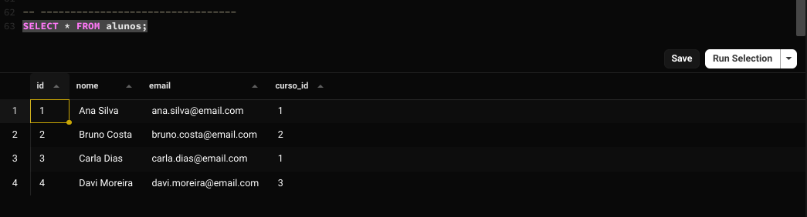

# Exercício 1: Banco relacional (SQL Básico)

Este exercício cobre os comandos básicos de SQL para Definição (DDL) e Manipulação (DML).

## 🎯 Objetivo

Criar as tabelas `cursos` e `alunos`, definir Chaves Primárias (PK) e Estrangeiras (FK) e inserir dados de teste.

O script SQL completo está salvo no arquivo `exercicio-1.sql`.

## Resultados (Prints)

Abaixo está o print do `SELECT * FROM alunos;`, provando que os 4 alunos foram inseridos corretamente.

