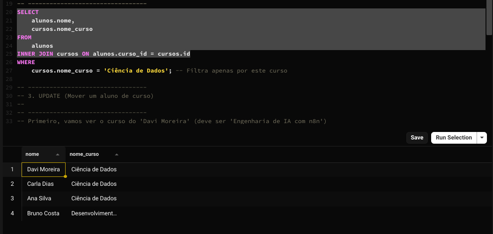
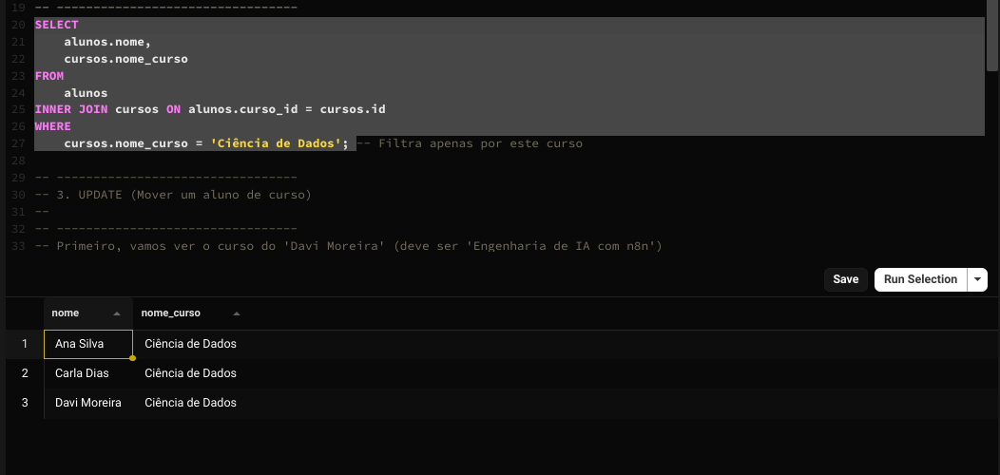
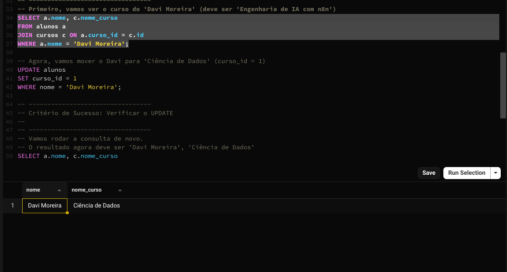
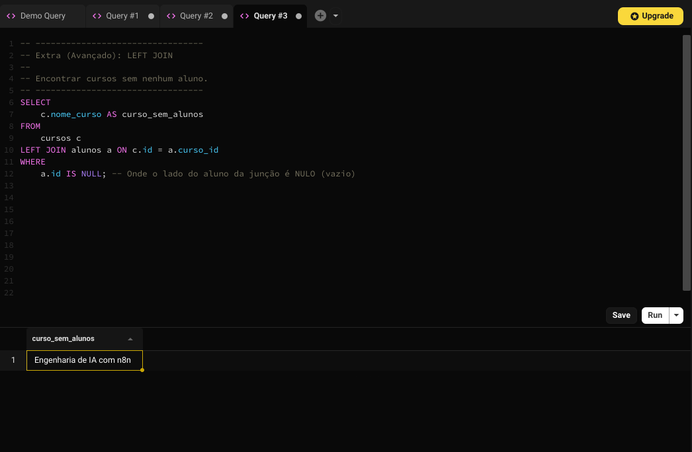

# Exercício 2: Banco relacional (JOINs e Filtros)

Este exercício cobre consultas mais avançadas com `INNER JOIN`, `WHERE`, `UPDATE` e o `LEFT JOIN` opcional.

## 🎯 Objetivo

Combinar dados de múltiplas tabelas, filtrar resultados e atualizar registros.

O script SQL completo está salvo no arquivo `exercicio-2.sql`.

## Resultados (Prints)

Abaixo estão os prints de cada consulta solicitada:

### 1. Resultado do INNER JOIN (Alunos e Cursos)

### 2. Resultado do JOIN com WHERE (Filtrando por "Ciência de Dados")

### 3. Resultado do UPDATE (Confirmação da mudança do Davi)

### 4. Extra: Resultado do LEFT JOIN (Cursos Vazios)
