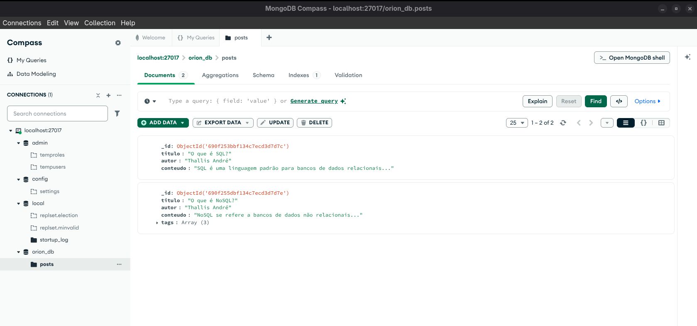

# Exercício 3: Não relacional (CRUD Básico)

Este exercício cobre os comandos básicos do MongoDB (`insertOne`, `find`) e o conceito de Schema Flexível.

## 🎯 Objetivo

Inserir documentos com estruturas diferentes (um com `tags` e outro sem) na mesma coleção para provar a flexibilidade do NoSQL.

Os documentos JSON usados estão salvos no arquivo `exercicio-3.js`.

## Resultados (Prints)

O print abaixo prova o Schema Flexível: o segundo documento tem o campo `tags` e o primeiro não.

