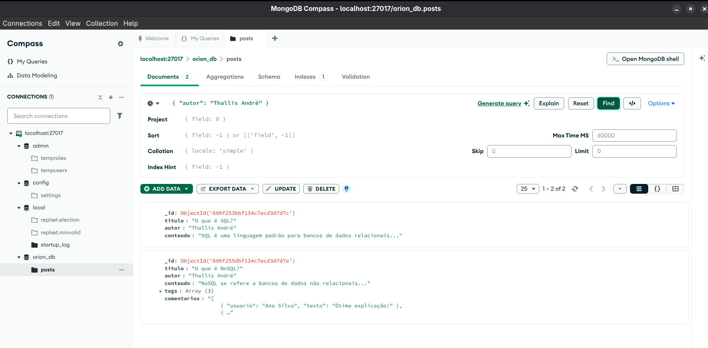
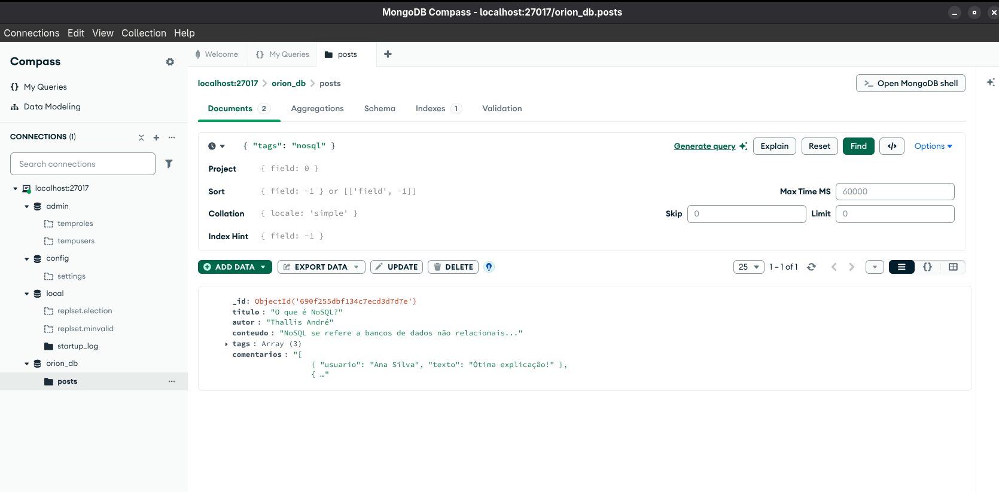

# Exercício 4: Não relacional (Consultas Avançadas)

Este exercício cobre `updateOne` para adicionar dados aninhados e `find` para filtrar por campos e arrays no MongoDB.

## 🎯 Objetivo

Atualizar um documento adicionando um array (`comentarios`) e depois filtrar a coleção por um campo de autor e por um valor dentro de um array (`tags`).

Os comandos e filtros usados estão salvos no arquivo `exercicio-4.js`.

## Resultados (Prints)

### 1. Resultado do Filtro por Autor (`{ "autor": "Thallis André" }`)

### 2. Resultado do Filtro por Tag (`{ "tags": "nosql" }`)
Este print também prova que o `updateOne` funcionou, pois o campo `comentarios` está visível.

